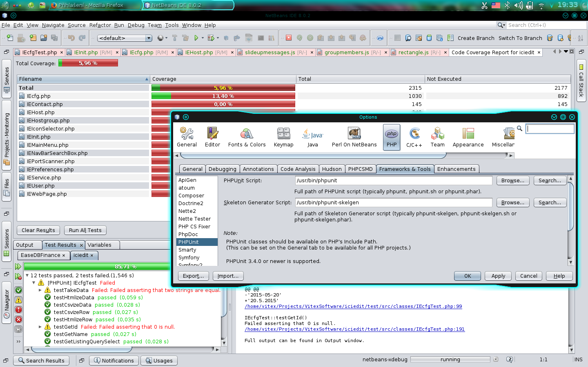

# netbeans-php-tools
Debian package contains tools for full value PHP development using netbeans

 * xdebug http://www.xdebug.org/
 * php Depend http://pdepend.org/
 * php Code Sniffer https://github.com/squizlabs/PHP_CodeSniffer
 * coding Standarts Fixer https://github.com/FriendsOfPhp/PHP-CS-Fixer
 * Mess Detector http://phpmd.org/
 * ApiGen https://github.com/apigen/apigen
 * Composer https://getcomposer.org/
 * PHPDoc http://www.phpdoc.de/
 * PHPUnit https://phpunit.de/
 * PHP Code Coverage 
 * PHP Copy/Paste Detector (PHPCPD) https://github.com/sebastianbergmann/phpcpd

#Installation:

1) in your /etc/php/php.ini please enable all development options  

2) install debian package:

    wget -O - http://v.s.cz/info@vitexsoftware.cz.gpg.key|sudo apt-key add -
    echo deb http://v.s.cz/ stable main > /etc/apt/sources.list.d/ease.list
    aptitude update
    aptitude install netbeans-php-tools

   Package install update file /etc/php5/mods-available/xdebug.ini by adding:

    xdebug.remote_enable = 1
    xdebug.remote_handler=dbgp
    xdebug.remote_mode=req
    xdebug.remote_host=127.0.0.1
    xdebug.remote_port=9000
    xdebug.file_link_format = "netbeans://%f?line=%l"
    xdebug.profiler_enable = 0

   Please review & control this changes. If you are using nginx,apache or 
   lighttpd package restart your webserver automatically. In other cases 
   please restart your webserver by hand.

3) in firefox open about:config and if not exists create new boolean key
   network.protocol-handler.expose.netbeans with false value.
   Then if you first time click on netbeans:// link in xdebug error message
   browser ask you for program for opening this type of adresses. Please choose
   /usr/bin/nbxdebug

4) In netbeans (with PHP support module installed) open Tools/Options/PHP menu 
   and try to click on all [SEARCH] buttons to locate tools on filesystem. 
   If there is no search button installed tool is always located in /usr/bin.

5) Happy coding, debugging a documenting!
 

